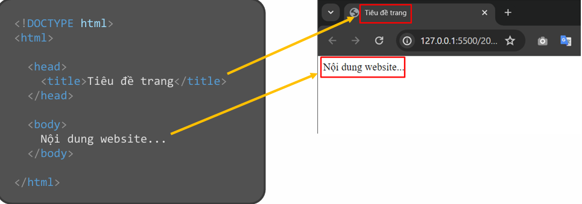

### *HTML-Hyper Text Markup Language:* Là ngôn ngữ đánh dấu siêu văn bản. HTML có tác dụng tạo bộ khung xương cho trang web.
 
# Một chương trình cơ bản của HTML
**Thường bao gồm:** các thành phần cốt lõi để hiển thị nội dung trên trình duyệt. Nó bao gồm cấu trúc trang HTML cơ bản, 
các thẻ để hiển thị văn bản, hình ảnh, liên kết, và khả năng kết hợp với CSS và JavaScript để định dạng và thêm tính năng
**Một cấu trúc của file HTML:**



Trong đó:
 - `<!DOCTYPE html>` (document type: html): để khai báo cho trình duyệt biết đây là kiểu tài liệu HTML.
 - `<html>`: Thẻ html để khởi tạo khung trang web.
 - `<head>`: Chứa các thông tin chung của trang web.
 - `<title>`: Nằm bên trong thẻ <head>, dùng để khai báo tiêu đề của trang  
 - `<body>`: Tất cả nội dung hiển thị trên website đều viết trong thẻ body


# Cách link css 
Có thể liên kết nó bằng cách sử dụng thẻ `<link>` trong phần `<head>` của tệp HTML.

**VD:** ```<link rel="stylesheet" href="path/to/styles.css">```

**Trong đó:**
  - `rel="stylesheet":` Xác định rằng đây là một tệp CSS.
  - `href="path/to/styles.css":` Đường dẫn đến tệp CSS (có thể là đường dẫn tương đối hoặc tuyệt đối). 

**VD minh họa:**

```css
<!DOCTYPE html>
<html lang="en">
<head>
    <meta charset="UTF-8">
    <meta name="viewport" content="width=device-width, initial-scale=1.0">
    <title>Bài tập</title>
    <link rel="stylesheet" href="styles.css">
</head>
<body>
    <h1>Chào mừng!</h1>
    <p>Đây là một ví dụ về cách liên kết CSS.</p>
</body>
</html>
```


**Hoặc có thể sử dụng cách khác:**

```css
<!DOCTYPE html>
<html lang="en">
<head>
    <meta charset="UTF-8">
    <meta name="viewport" content="width=device-width, initial-scale=1.0">
    <title>Bài tập HTML</title>
<style>
    body {
      font-family: Arial, sans-serif;
      background-color: #f4f4f4;
      color: #333;
    }
    h1 {
      color: #0066cc;
    }
</style>
</head>
<body>
    <h1>Chào mừng!</h1>
    <p>Đây là một ví dụ về cách liên kết CSS.</p>
</body>
</html>
```
# Cách link js
 Tệp JavaScript thường được sử dụng để thêm chức năng động cho trang web. Bạn có thể liên kết nó bằng cách sử dụng thẻ `<script>`.

 **VD:** ```<script src="path/to/script.js"></script>```

 **Trong đó:**
  `src="path/to/script.js"`: Đường dẫn đến tệp JavaScript.

**VD minh họa:**

```javascript
<!DOCTYPE html>
<html lang="en">
<head>
    <meta charset="UTF-8">
    <meta name="viewport" content="width=device-width, initial-scale=1.0">
    <title>Liên kết JavaScript</title>
</head>
<body>
    <h1 id="greeting">Hello!</h1>
    <button id="changeTextBtn">Click Me</button>
    <script src="script.js"></script>
</body>
</html>
```
